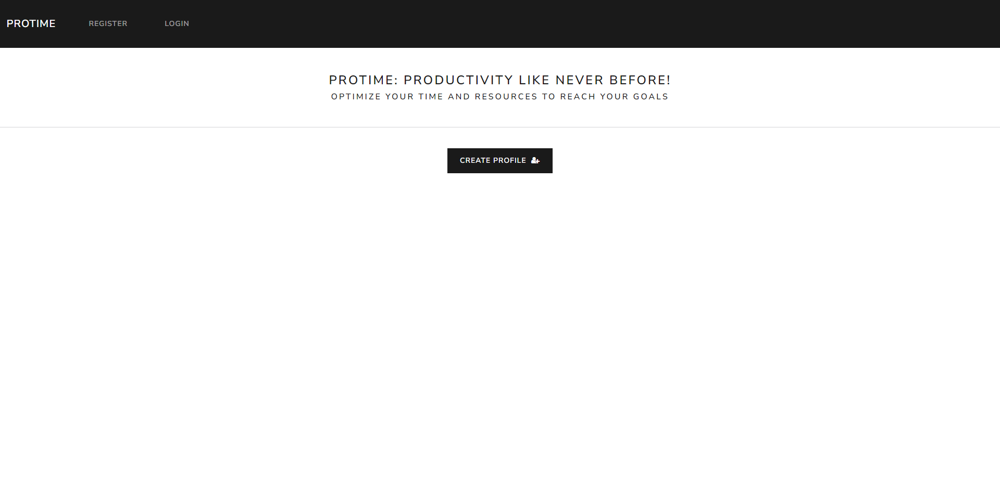
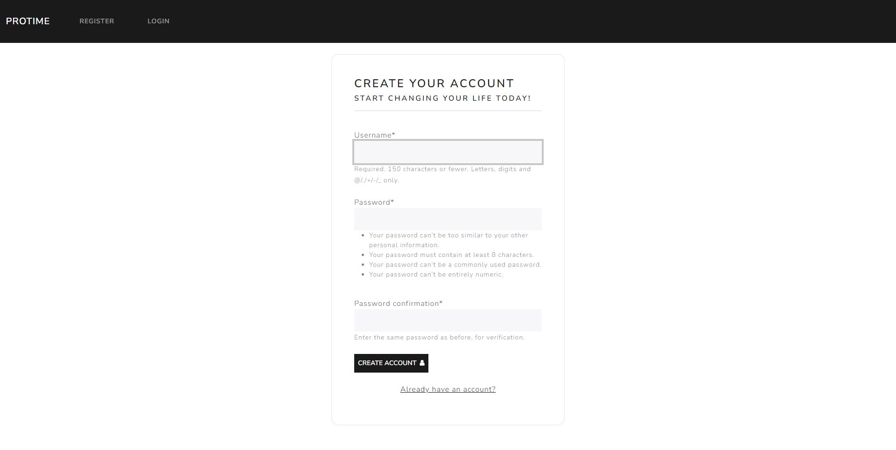
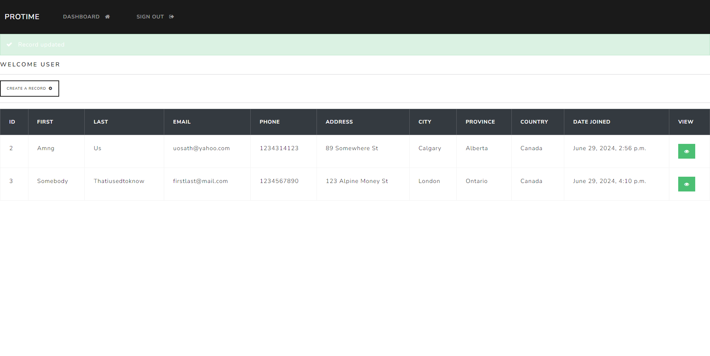
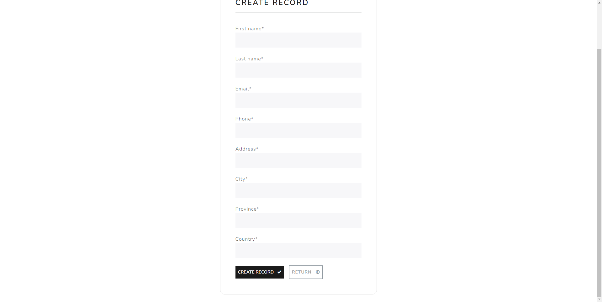
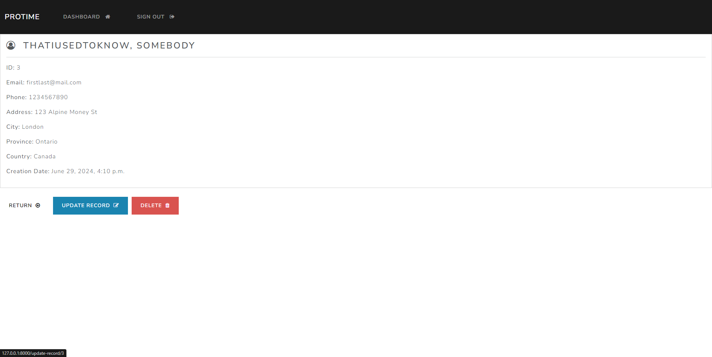
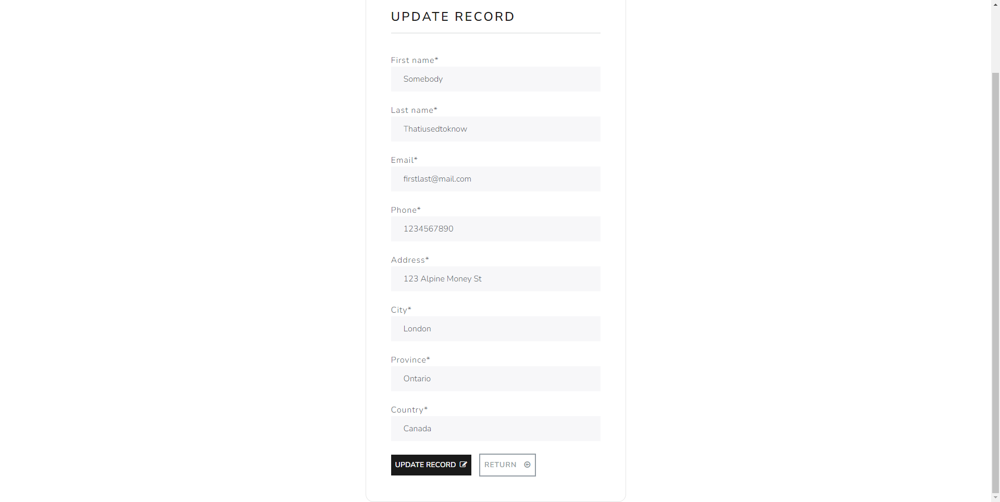

**python manage.py runserver**  
CRUD mastery with Django following tutorial  
Basic app to login, create, read, update, and delete users in a table format  
Uses Python, Django, JavaScript, HTML, CSS, Bootstrap, Crispy Forms, Font Awesome Icons, and Pytest

## Gallery

### Home

### Register

### Dashboard

### Create

### View and Delete User

### Update
